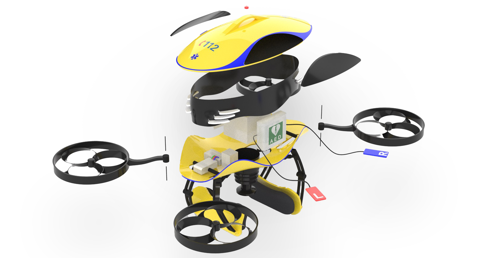
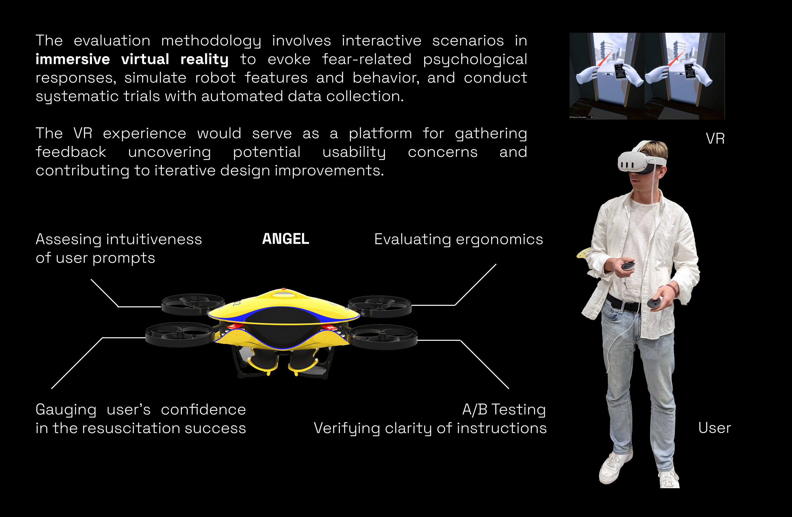
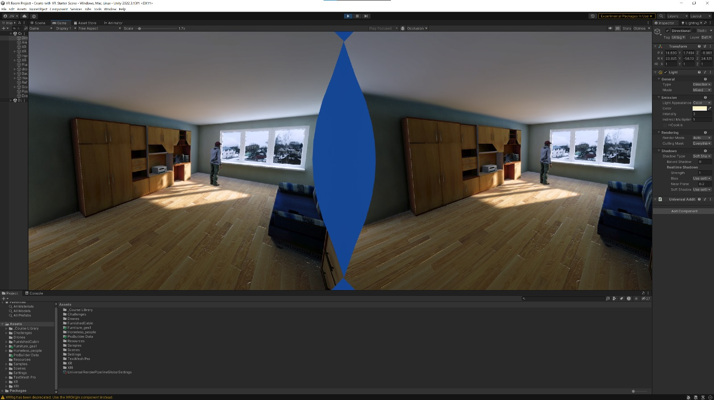
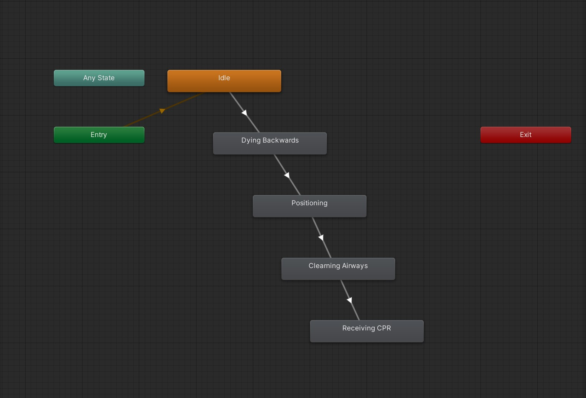

# **Angel Drone VR Simulation**

## **Usage of the simulator**
The simulator is open-source and free to use. It is aimed for, but not limited to, academic research. We welcome forking of this repository, pull requests, and any contributions in the spirit of open science and open-source code. For collaboration enquiries, you may contact the researcher at: j.woziwodzki@student.tue.nl or project coach at: p.bazilinskyy@tue.nl.

## **Overview**
Explore the 'Angel' interactive VR demo. This design project is an exploration into a drone-assisted cardiac emergency response system that integrates a drone with a CPR device.   
>What is an [automated CPR device](https://www.lucas-cpr.com/)?

   
  

  
 Methodology & background 

  
  
To evaluate the Angel Drone concept, we drew inspiration from David J. Atkinson and Micah H. Clak's (2014) research on studying human-robot interaction in dangerous situations.

  
  
Their methodology involves immersive virtual reality to evoke fear-related psychological responses, simulate robot features and behaviour, and conduct systematic trials with automated data collection. Our VR experience aligns with this approach, aiming to create a realistic environment where users perceive heightened risk, similar to a real-world situation.

  
  
The Interactive VR Experience serves the dual purpose as a communicative and evaluation tool for the Angel Drone concept. At a high level, users will move around in a realistic indoor environment, actively participating in the unfolding narrative.

  
  
Users will step into the shoes of Linda, a caregiver facing a heart attack emergency involving her partner, John, in their suburban house. Through this immersive narrative presented from Linda's perspective, our teams aimed to effectively convey the system's key features and user interactions.

  
  
The goal is for users to experience and review the design of the drone-enhanced emergency response system. This form of presentation will be especially impactful in VR due to the heightened sense of presence and emotional connection to the scenario due to the 6 degrees of freedom in movement, and rotation of their head and controllers. Coupled with stereo audio and haptic feedback, the immersive space allows for a more complete understanding of the system's potential benefits and areas of improvement. The user will be able to perform  tasks and interactions. 

> Go to [Project Page](https://mobility-squad.com/angel)

## **Purpose**
1. The VR experience communicates the project's innovation and interaction concerns
2. Serves as an evaluation tool for usability and UX feeding the iterative loop of improvements.

## **Enviroment**

The current version of the Angel Drone Simulator features a single interactive scenario set in a small, one-room suburban home environment. The simulation places you in the afternoon as John, a resident of the home, suffers a heart attack. the user's role is to help and experience firsthand how the Angel drone assists in such an emergency.

## **The simulation**

1. Emergency Initiation: The scenario begins with John experiencing a heart attack.
2. Angel Drone Intervention: Due to its faster response time compared to traditional ambulances, the Angel drone arrives on the scene quickly.
3. User Assistance: As the user, you play a crucial role in supporting the drone's operation. This may involve tasks like: Opening the front door to grant the drone access to the home, positioning John in an optimal way for treatment by the drone or clearing John's airways to facilitate proper medical intervention.
4. Future Expansion: The simulator is designed to be expandable. Future versions will incorporate a wider variety of scenes with different environments and potentially altered drone functionalities. These expanded scenarios will allow for testing various assumptions and gathering valuable insights through comparisons with benchmark data.

## **Input**

1. Keyboard and Mouse: For standard desktop use.
2. VR Headset + controllers: Meta Quest 3 (or equivalent) for immersive simulation and interaction within the VR environment
   
## Output

1. Computer Screen: Supports standard desktop display.
2. Head-Mounted Display (HMD): Optimized for VR use. Tested with the Meta Quest 3.

## **Usage**
The following section will outline how to use and expand upon the simulation.

### **Scenes & Hierarchy** 
Each scene has a hierarchy composed of the following components: 
#### A) **Lighting**
Controls the lighting elements within the scene.
#### B) **XR**
All XR-related components can be found and controlled here. These components include the XR Origin (player camera, camera-floor offset) and the XR device simulator. For further details, see the [XR Interaction Toolkit Documentation](https://docs.unity3d.com/2021.1/Documentation/Manual/com.unity.xr.interaction.toolkit.html)
#### C) **Static**
Static objects are all objects that do not have a dynamic function in the scene, like certain house objects or background buildings for instance.
#### D) **Dynamic**
 These are interactive objects that play a dynamic role in the scene. As a player, you can interact with them. Key dynamic objects include:
 1. *Navigational mats:* These facilitate a teleportation locomotion system for both the simulated VR experience on desktop and VR setup.
 3. *The Angel drone:* Animated drone that is at the core of this simulation. In the future could have an integrated interactable AED device (AED Pads with sockets)
 4. *The phone:* An interactive (grabbable) object that facilitates instructions to the user throughout the playthrough
 5. *John:* An interactive animated character experiencing a heart attack. The user can position John and clear his airways (in the future perform manual CPR)
   
Refer to the [XR Interaction Toolkit Manual](https://learn.unity.com/tutorial/using-interactors-and-interactables-with-the-xr-interaction-toolkit) for more information on XR Interactables.
#### E) **Interface**
1. The phone interface provides visual and audible instructions (simulates communication with an emergency operator).
2. The TV interface serves as the main menu where the player can start the game, switch scenes, and reset them.
#### F) **Triggers**
Closely linked to dynamic objects, this category includes triggers (e.g., colliders) and scripts that control the game's structure and progression.
##### G) **Event Manager**
the event manager is the main c# script tying together various dynamic objects and triggers with events that create a linear game progression. As an example positioning john, triggers a collider on the door allowing for the next interaction.

## **Setup** 
once you open up the project, go to `Window` --> `Package Manager`
Make sure you have all relevant and up-to-date XR packages installed: 
> `XR plugin Management`,
> `XR core utilities`,
> `XR Interaction Toolkit`,
> `Input System1`,
> `Mock HMD XR Plugin`

### **Desktop setup**
1. Navigate to `Edit`--> `Project Settings` --> `XR Plugin Management`
> Select The `Mock HMD Loader`
2. Next head to the Project Hierarchy under XR and make sure the `XR Device Simulator` is *activated* in the inspector panel.
3. `Run` the game
4. Tweek the `camera offset` value if necessary under `XR` --> `XR Origin` --> `Camera Offset`

### **VR setup**
1. Navigate to `Edit`--> `Project Settings` --> `XR Plugin Management`
> Select the `Mock HMD Loader`
 2. Next head to the `Project Hierarchy` and under `XR` make sure the `XR Device Simulator` is *deactivated* (in the inspector panel).
3. `Run` the game
4. Tweek the `Camera Offset` value (inspector panel) if necessary under `XR` --> `XR Origin` --> `Camera Offset`

## **Animations & Transitions**

> Animations specific to a dynamic object follow a sequential transition pattern based on changes in states due to activated triggers throughout the game. These can be altered in the `animator panel`.

## **Evaluation Facets and Methodologies**

While designing the VR experience our team identified different layers of the angel drone system and 
valid approaches to evaluate them giving insights into user perceptions and preferences. These 
proposed facets to explore would eventually feed into the loop of iterative design improvements and 
inevitably to controlled scenarios and design variations that would need further investigation

> List of proposed evaluation topics conducted with the VR setup.

| Facet | Approach | Methodology | Rationale |
|---|---|---|---|
| Aesthetics & Emotional Impact | Present different drone models/variations in various scenes | User feedback surveys on visual appeal, comfort, and perceived effectiveness. A/B testing with variations. | Identify user preferences and optimize for visual appeal, recognizability and trust |
| User Confidence in Resuscitation Success | Represent multiple scenarios in scenes with both drones and human respondents (AED volunteers) as a baseline measurement | Real-time confidence perception slider, questionnaires measuring perceived effectiveness | Gauge user trust in different resuscitation approaches |
| Intuitiveness of User Prompts, Instructions & Engagement | Assess clarity of prompts and instructions | Observations, surveys with scales, questionnaires | Ensure users easily comprehend and follow system instructions |
| Interaction Types and Effectiveness | Implement different interaction types and interfaces for the drone | Gaze-tracking & heatmaps, post-demo interviews or surveys, Real-time observations | Evaluate user comfort and efficiency with varied interaction method |

## **Future Work Propositions**

  
 In the following table, the team presents a list of design research considerations that future teams 
could build upon.

  | Topic | Elaboration | Design Research Category |
  |---|---|---|
  | Investigating the least threatening aesthetic/exterior design for the drone | As mentioned in Evaluation Facets and Methodologies, user feedback could be valuable in optimizing visual appeal. | Design for aesthetics |
  | Redesigning the adjustable grabbers that attach to patients securely | Using inflatables to attach the CPR drone to a patient is novel, but untested. Further research investigating the most optimal way to attach to a patient is crucial. | Engineering design |
  | Investigating the optimal way of communicating with users in cardiac emergency scenarios | In medical emergencies, communication should be clear yet calming (A. Jordan, 2023). What would be the most calming, yet efficient way of communicating with users in cardiac emergency scenarios? | Interaction design |
  | Investigating the preferred “face” of the drone | As in automotive design, design elements can resemble anthropomorphic facial features. What “face” design, if any at all, is considered most visually appealing and reassuring amongst users? | Design for aesthetics |
  | Investigating the least threatening flight path | As indicated by one of the team’s coaches, the way the drone moves and approaches could influence trust amongst recipients. | Interaction design |
  | Further optimizing interactions for efficiency (time is key) and user-friendliness | In high-stakes scenarios like reanimations, how can one design for ergonomic and user-friendly interactions and instructions? | Interaction design |
  | Investigating the potential for more autonomous medical drone operations | Though decided to not focus on this project, further exploring to what extent drones can handle cardiac emergencies without the assistance of human responders could be valuable for cases where the patient is alone. | Engineering design |
  | Designing an optimized network of launch stations for medical emergency drones | What would be the logistics behind a medical drone network? How will they be distributed across the country, launched, charged, and operated? Such questions could be investigated in future research. | Engineering design | 

## **Used Assets** 

> Asstes taken from [Unity Asset Store](https://assetstore.unity.com/)

1. https://assetstore.unity.com/packages/3d/props/furniture/hdrp-furniture-pack-153946
2. https://assetstore.unity.com/packages/3d/characters/humanoids/humans/free-scavenger-261065
3. https://assetstore.unity.com/packages/3d/props/furniture/pack-gesta-furniture-1-28237
4. https://assetstore.unity.com/packages/3d/props/interior/door-free-pack-aferar-148411

Assets from the [VR Development Pathway](https://learn.unity.com/pathway/vr-development) were used. I highly recommend following this Unity lessen to start expanding on this simulation setup. You will get more aquainted with VR basics, Event, interactions, Ergonomics, optimization & more.
