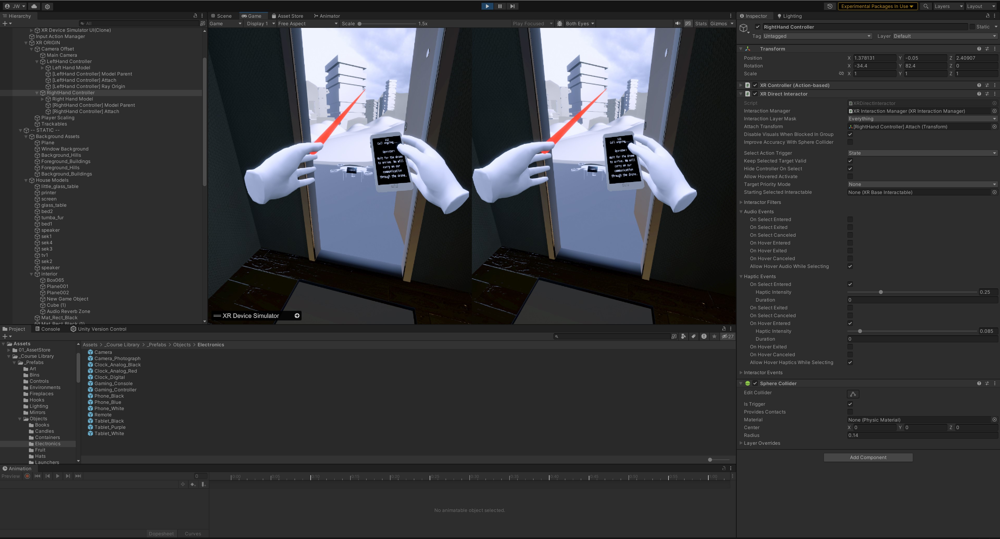

# **Angel VR Project Demo**

## Usage of the simulator
The simulator is open-source and free to use. It is aimed for, but not limited to, academic research. We welcome forking of this repository, pull requests, and any contributions in the spirit of open science and open-source code  For enquiries about collaboration, you may contact j.woziwodzki@student.tue.nl

## Overview
Explore the 'Angel' interactive VR demo. This design project is an exploration into a drone-assisted cardiac emergency response system that integrates a drone with a CPR device.

  
 Methodology & background 

  
  
To evaluate the Angel Drone concept, we drew inspiration from David J. Atkinson and Micah H. Clak's (2014) research on studying human-robot interaction in dangerous situations.

  
  
Their methodology involves immersive virtual reality to evoke fear-related psychological responses, simulate robot features and behavior, and conduct systematic trials with automated data collection. Our VR experience aligns with this approach, aiming to create a realistic environment where users perceive heightened risk, similar to a real-world situation.

  
  
The Interactive VR Experience serves the dual purpose as a communicative and evaluation tool for the Angel Drone concept. At a high level, users will move around in a realistic indoor environment, actively participating in the unfolding narrative.

  
  
Users will step into the shoes of Linda, a caregiver facing a heart attack emergency involving her partner, John, in their suburban house. Through this immersive narrative presented from Linda's perspective, our teams aimed to effectively convey the system's key features and user interactions.

  
  
The goal is for users to experience and review the design of the drone-enhanced emergency response system. This form of presentation will be especially impactful in VR due to the heightened sense of presence and emotional connection to the scenario due to the 6 degrees of freedom in movement, and rotation of their head and controllers. Coupled with stereo audio and haptic feedback, the immersive space allows for a more complete understanding of the system's potential benefits and areas of improvement. The user will be able to perform simple tasks and interactions, such as helping to position John optimally, clearing his airways, opening doors, and following instructions given by the drone operator.

> Go to [Project Page](https://mobility-squad.com/angel)

## Purpose
1. The VR experience communicates the project's innovation and interaction concerns
2. Serves as an evaluation tool for usability and UX feeding the iterative loop of improvements.

    as a baseline measurement | Real-time confidence perception slider, questionnaires measuring perceived effectiveness | Gauge user trust in different resuscitation approaches |
| Intuitiveness of User Prompts, Instructions & Engagement | Assess clarity of prompts and instructions | Observations, surveys with scales, questionnaires | Ensure users easily comprehend and follow system instructions |
| Interaction Types and Effectiveness | Implement different interaction types and interfaces for the drone | Gaze-tracking & heatmaps, post-demo interviews or surveys, Real time observations | Evaluate user comfort and efficiency with varied interaction method |

## Future Work Propositions

  
 In the following table, the team presents a list of design research considerations that future teams 
could build upon.

  | Topic | Elaboration | Design Research Category |
  |---|---|---|
  | Investigating the least threatening aesthetic/exterior design for the drone | As mentioned in Evaluation Facets and Methodologies, user feedback could be valuable in optimizing visual appeal. | Design for aesthetics |
  | Redesigning the adjustable grabbers that attach to patients securely | Using inflatables to attach the CPR drone to a patient is novel, but untested. Further research investigating the most optimal way to attach to a patient is crucial. | Engineering design |
  | Investigating the optimal way of communicating with users in cardiac emergency scenarios | In medical emergencies, communication should be clear yet calming (A. Jordan, 2023). What would be the most calming, yet efficient way of communicating with users in cardiac emergency scenarios? | Interaction design |
  | Investigating the preferred “face” of the drone | As in automotive design, design elements can resemble anthropomorphic facial features. What “face” design, if any at all, is considered most visually appealing and reassuring amongst users? | Design for aesthetics |
  | Investigating the least threatening flight path | As indicated by one of the team’s coaches, the way the drone moves and approaches could influence trust amongst recipients. | Interaction design |
  | Further optimizing interactions for efficiency (time is key) and user-friendliness | In high-stake scenarios like reanimations, how can one design for ergonomic and user-friendly interactions and instructions? | Interaction design |
  | Investigating the potential for more autonomous medical drone operations | Though decided to not focus on this project, further exploring to what extent drones can handle cardiac emergencies without the assistance of human responders could be valuable for cases where the patient is alone. | Engineering design |
  | Designing an optimized network of launch stations for medical emergency drones | What would be the logistics behind a medical drone network? How will they be distributed across the country, launched, charged, and operated? Such questions could be investigated in future research. | Engineering design | 

## Used Assets

1. https://assetstore.unity.com/packages/3d/props/furniture/hdrp-furniture-pack-153946
2. https://assetstore.unity.com/packages/3d/characters/humanoids/humans/free-scavenger-261065
3. https://assetstore.unity.com/packages/3d/props/furniture/pack-gesta-furniture-1-28237
4. https://assetstore.unity.com/packages/3d/props/interior/door-free-pack-aferar-148411
